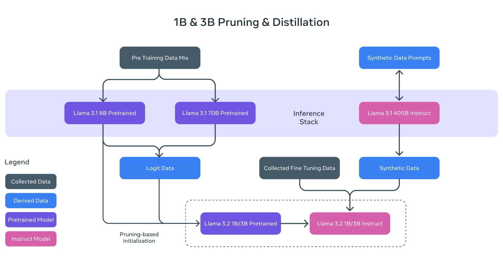

# Llama 3.2 : Meta met à nouveau les bouchées doubles en matière d’intelligence artificielle

**Publié le 25 septembre 2024 à 23:19**

Meta a dévoilé la dernière version de son IA open-source, **Llama 3.2**, lors de Meta Connect 2024. Cette version offre des capacités multimodales, avec la possibilité de traiter à la fois du texte et des images, et d'interagir vocalement en utilisant des voix de célébrités.

## Fonctionnalités principales

- **Multimodalité** : Llama peut traiter simultanément du texte et des images, facilitant des tâches comme l'analyse de photos ou la génération de légendes.
- **Reconnaissance vocale** : Llama intègre un module de reconnaissance vocale, permettant des interactions naturelles et la synthèse vocale avec des voix de célébrités.
- **AI Studio** : Permet la création d'avatars virtuels pour des interactions en vidéo, idéal pour des applications comme Instagram et Messenger.

## Modèles SLM : Compacts et performants

Les modèles **SLM (Small Language Models)**, comprenant les versions 1B et 3B, sont conçus pour offrir des performances élevées sur des appareils légers, tels que les smartphones et dispositifs embarqués. Ces modèles utilisent des techniques avancées comme **l’élagage (pruning)** et la **distillation** pour optimiser les performances tout en réduisant la taille et la consommation de ressources.

Le but principal des modèles SLM est de permettre une utilisation locale et efficace sur des appareils peu puissants. Ils sont idéaux pour des tâches comme le **suivi d’instructions**, la **synthèse** et la **réécriture**, tout en offrant une faible latence. Leur compatibilité avec les architectures **Arm**, notamment les processeurs **Qualcomm** et **MediaTek**, en fait une solution flexible pour les applications mobiles.

Les versions SLM sont également **facilement personnalisables** grâce à des outils comme **TorchTune**, ce qui permet aux développeurs d'adapter ces modèles à des besoins spécifiques sans avoir besoin d’infrastructures lourdes.

## Disponibilité

Llama 3.2 sera disponible gratuitement sur **WhatsApp**, **Instagram**, **Facebook**, et **Messenger**. Toutefois, les versions multimodales ne seront pas accessibles en Europe tant que Meta n’aura pas résolu les questions de conformité avec les régulations européennes.

  
*Llama devient multimodal et peut travailler avec des images*

---

**Sources** : [Frandroid](https://www.frandroid.com/marques/meta/2349720_llama-3-2-meta-met-a-nouveau-les-bouchees-doubles-en-matiere-dintelligence-artificielle)